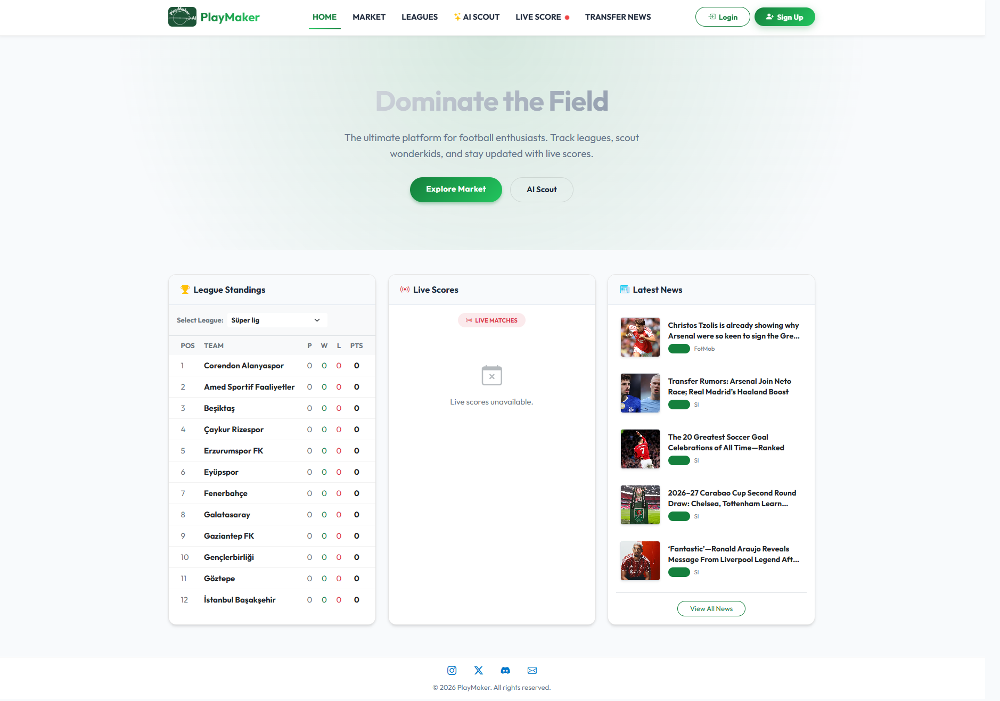
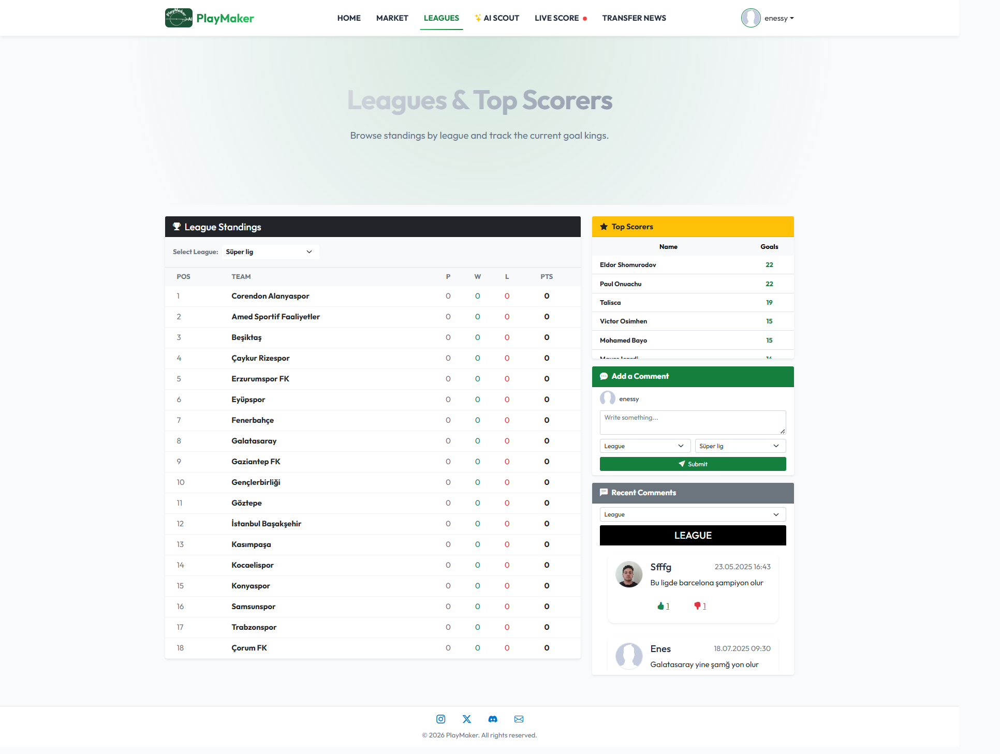
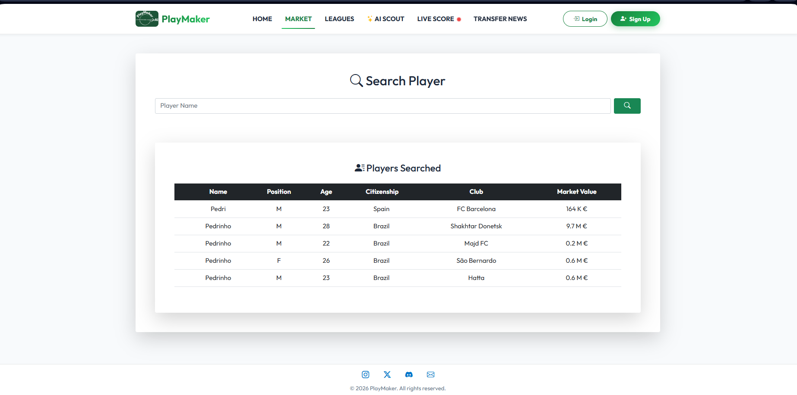
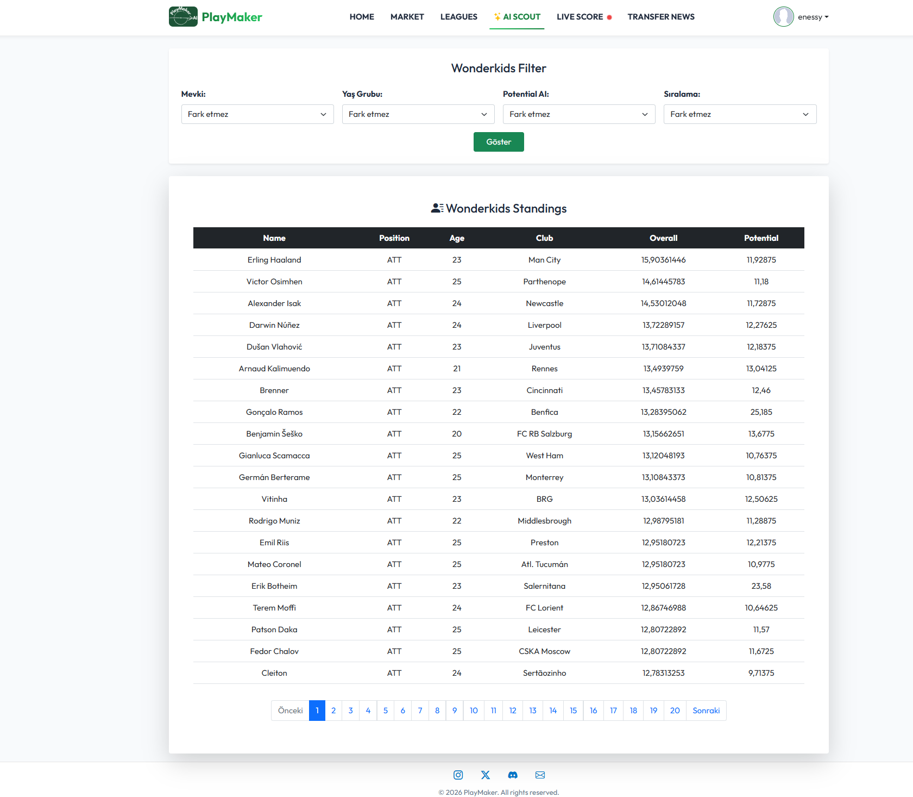
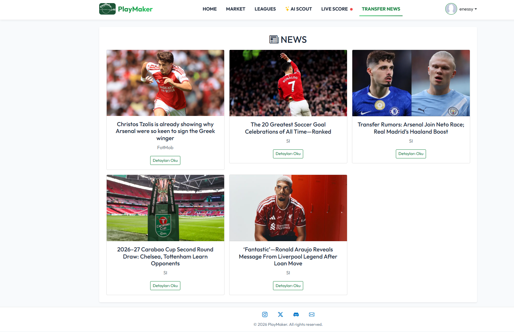

# PlayMaker

Football-focused ASP.NET Core MVC application that aggregates league standings, top scorers, football news, and player data from third-party APIs, with authentication, comments, and a Football Manager–based scout module.

## Overview

PlayMaker brings Super Lig standings, goal leaders, player search with market values, and football news into one web app. User accounts, comments, and match polls sit on ASP.NET Core Identity and PostgreSQL. External football data comes from CollectAPI and RapidAPI (SofaScore / news).

## Features

- Turkish Super League standings
- Top scorers (Goal Kings)
- Football news feed
- Player search and profile details
- Market value information
- ASP.NET Core Identity (register, login, profile)
- League / team / player comments
- Match polls (UI ready; depends on live match data availability)
- AI Scout / Wonderkids (Football Manager dataset + custom filtering and scoring)
- Live Score UI with a safe unavailable fallback when the provider subscription is inactive

## Tech Stack

- ASP.NET Core 8 MVC
- C#
- Entity Framework Core
- PostgreSQL
- ASP.NET Core Identity
- Npgsql
- Razor
- Bootstrap
- MemoryCache
- RapidAPI
- CollectAPI
- EPPlus

## External APIs

| Feature | Source |
|---|---|
| Standings | CollectAPI (SofaScore fallback if CollectAPI fails) |
| Top Scorers | SofaScore via RapidAPI |
| Player Search / Profile | SofaScore via RapidAPI |
| Football News | RapidAPI |
| Live Score | Requires an active third-party subscription |

## AI Scout / Wonderkids

AI Scout / Wonderkids processes Football Manager player data and ranks young players using custom filtering and scoring logic. It is a data-processing and ranking feature (Excel + EPPlus), not a trained machine-learning model.

## Screenshots

### Home



### League & Top Scorers



### Player Market



### AI Scout / Wonderkids



<details>
<summary>News (optional)</summary>



</details>

## Configuration

1. Clone the repository
2. Copy `PlayMaker/appsettings.Example.json` → `PlayMaker/appsettings.Development.json`
3. Add your PostgreSQL connection string and API keys
4. **Do not commit** real secrets (`appsettings.Development.json` is gitignored)

Required: `ConnectionStrings`, `SofaScoreApi`, `CollectApi`, `FootballNewsApi`.  
`LiveScoreApi` is optional until subscribed. CollectAPI keys use the `apikey ` prefix.

## Running Locally

Requirements: .NET SDK 8, PostgreSQL.

```bash
git clone https://github.com/enessoydan33/PlayMaker.git
cd PlayMaker

# Create PlayMaker/appsettings.Development.json from the Example file first

dotnet restore
dotnet build
dotnet ef database update --project PlayMaker/PlayMaker.csproj
dotnet run --project PlayMaker/PlayMaker.csproj
```

## Limitations

- Live score functionality depends on an active third-party API subscription. The application falls back to an unavailable state instead of crashing.
- Free API plans enforce rate limits; MemoryCache reduces repeat calls.
- External data availability depends on third-party providers.
- Top scorers / SofaScore standings fallback are mapped for Super Lig.

## License

Educational / portfolio project.
